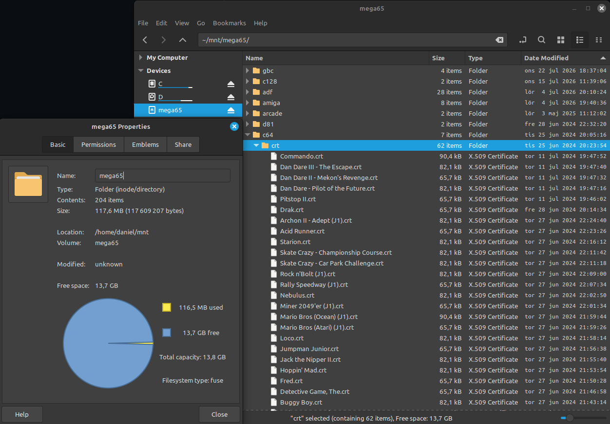
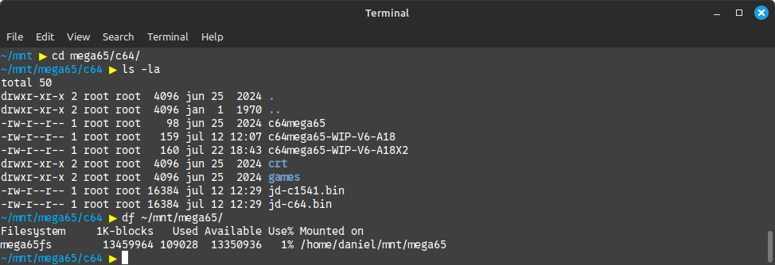

# mega65fs — FUSE filesystem for MEGA65 SD card over ethernet

Mount a MEGA65's SD card as a local directory via ethernet (ETHLOAD.M65
must be running on the machine).  Uses the MEGA65-FTP protocol to talk to
the MEGA65's built-in FTP-over-ethernet loader.

**Linux only.** This filesystem driver requires FUSE 3 and `fusermount`,
so it cannot be built or run on macOS or Windows.

## Dependencies

- FUSE 3.x (`libfuse3-dev` / `fuse3`)
- libusb 1.0 (`libusb-1.0-0-dev`)
- readline (`libreadline-dev`)
- GCC, make, pkg-config

## Build

    make

Produces `bin/mega65fs`.

## Usage

    ./bin/mega65fs /your/mountpoint -f

Foreground (`-f`) is recommended so you can see diagnostics.  The first
connection attempt to the MEGA65 appears in the output.

When the filesystem is no longer needed, unmount with:

    fusermount -u /your/mountpoint

### Notes

- All file operations are single-threaded (FUSE `-s` equivalent) — the
  MEGA65-side FTP helper is not re-entrant.
- Directory listing is cached for 5 seconds.
- Writeback buffering: new files are accumulated in host memory and
  written to the SD card as one contiguous block when closed.

## Screenshots

## License

GPL-3.0 (see [`LICENSE`](LICENSE)). The MEGA65-FTP library
(`lib/libm65ftp/`), vendored from the [MEGA65](https://mega65.org) tools
project, is GPL-3.0 licensed; since it is statically linked into this
FUSE wrapper, the combined binary is distributed under the same terms.

## Disclaimer

**USE AT YOUR OWN RISK.** This tool modifies the FAT32 filesystem on your
SD card. While it has been tested, there is always a risk of data loss or
corruption. The author makes no warranties and accepts no responsibility
for any damage or data loss that may occur. Back up your SD card before
use.
